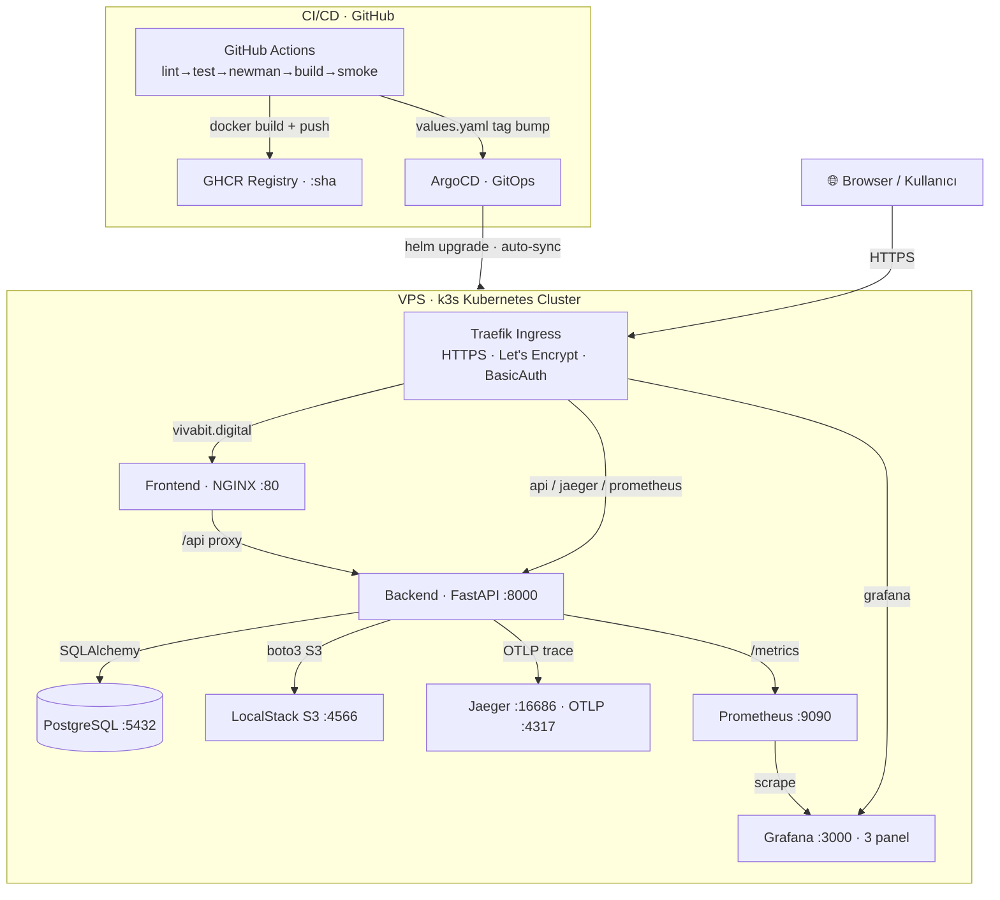

# Habit Tracker (Simple)

**Marmara Üniversitesi — Bulut Mimarilerinde Test Mühendisliği — Dönem Projesi**

Günlük alışkanlık takibi yapan minimal bir REST API. Şartnamenin **tüm** gereksinimlerini + **3 bonus (Helm +5, OpenTelemetry/Jaeger +5, ArgoCD +5 = bonus tavanı)** karşılar. Abartı yok, savunulması kolay.

> Bu proje, aynı yazarın `habit-tracker-api` reposunun **lightweight** versiyonudur.

---

## 🌐 Canlı Demo

Uygulama gerçek bir VPS'te **k3s Kubernetes** cluster'ında çalışıyor (Helm + ArgoCD GitOps + Traefik + Let's Encrypt HTTPS):

| Servis | URL | Erişim |
|--------|-----|--------|
| **Uygulama** | https://vivabit.digital | Herkese açık |
| Grafana | https://grafana.vivabit.digital | 🔒 Login |
| ArgoCD | https://argocd.vivabit.digital | 🔒 Login |
| API Docs (Swagger) | https://api.vivabit.digital/docs | 🔒 BasicAuth |
| Jaeger (tracing) | https://jaeger.vivabit.digital | 🔒 BasicAuth |
| Prometheus | https://prometheus.vivabit.digital | 🔒 BasicAuth |

> 🔑 Korumalı servislerin kimlik bilgileri repoda **düz metin tutulmaz** — `.env` (lokal) ve cluster Secret'larında saklanır. Demo erişimi için kimlik bilgileri sunumda/özelde paylaşılır.

🎥 **Demo videosu:** _(buraya Drive/YouTube linki — sunumda canlı demo çökerse yedek)_

---

## 🏗️ Mimari

> Diyagram **Mermaid** ile yazıldı (kaynak: [docs/architecture.mmd](docs/architecture.mmd)), PNG export: [docs/architecture.png](docs/architecture.png)



- **Frontend** ve **Backend** tamamen ayrı: backend HTML üretmez, frontend NGINX'ten static serve edilir; iletişim NGINX `/api` reverse proxy ile.
- **GitOps:** GitHub'a push → CI build → ArgoCD k3s'e otomatik deploy.
- **Tek `.env` dosyası** — backend, docker-compose ve k8s ConfigMap aynı kaynaktan okur.

---

## 🚀 Hızlı Başlangıç

```bash
cp .env.example .env
docker-compose up -d --build
```

| Servis | URL | Açıklama |
|---|---|---|
| **Frontend UI** | http://localhost:8080 | Login · Register · Dashboard |
| **Backend API** | http://localhost:8000 | REST endpoint'leri |
| **Swagger UI** | http://localhost:8000/docs | Interaktif API dokümanı |
| **ReDoc** | http://localhost:8000/redoc | Alternatif API dokümanı |
| **/health** | http://localhost:8000/health | Sağlık kontrolü (JSON) |
| **/metrics** | http://localhost:8000/metrics | Prometheus formatı |
| **Grafana** | http://localhost:3000 | login (bkz. `.env`) · 3 panel |
| **Prometheus** | http://localhost:9090 | Metrik sorgu UI |
| **Jaeger UI** | http://localhost:16686 | Distributed tracing (+5 bonus) |
| **LocalStack** | http://localhost:4566 | S3 emülatörü (Community Edition) |

---

## 📡 API Endpoint'leri

| # | Method | Path | Auth | Açıklama |
|---|---|---|---|---|
| 1 | POST | `/register` | – | Yeni kullanıcı |
| 2 | POST | `/login` | – | JWT token |
| 3 | POST | `/habits` | ✓ | Habit oluştur (kategori + haftalık hedef) |
| 4 | GET | `/habits` | ✓ | Habit listesi |
| 5 | POST | `/habits/{id}/track` | ✓ | Bugün yap/geri al (UPSERT + mood + notes) |
| 6 | GET | `/habits/{id}/logs` | ✓ | Günlük kayıt geçmişi (mood dahil) |
| 7 | DELETE | `/habits/{id}` | ✓ | Alışkanlık sil |
| 8 | GET | `/habits/{id}/streak` | ✓ | Mevcut seri + toplam tamamlama |
| 9 | POST | `/habits/{id}/photo` | ✓ | S3'e fotoğraf yükle |
| 10 | GET | `/habits/{id}/photos` | ✓ | S3'teki fotoğrafları listele |
| 11 | GET | `/habits/{id}/photo-file` | ✓ | S3'ten fotoğrafı stream et (UI thumbnail) |
| – | GET | `/health` | – | Sağlık |
| – | GET | `/metrics` | – | Prometheus |
| – | GET | `/docs` | – | Swagger UI |

> **Mood tracking:** `/track` çağrısında `mood` alanı (5 seviyeli emoji: 😣😕😐🙂😄) opsiyonel olarak gönderilir, geçmişte ve bugün özetinde gösterilir. `done=false` ile aynı endpoint tamamlamayı geri alır (toggle).

---

## 🎨 Frontend UI

Dashboard **iki bölümden** oluşur:

- **Bugün Takip Edilenler** — bugün tamamlanan habitler özet chip'leri (mood emoji + streak ile)
- **Tüm Alışkanlıklar** — yapılmayanlar üstte sıralı; her kart için detaylı etkileşim

Her habit kartında sunulan etkileşimler:

- **"Bugün Yaptım" / geri al** — `POST /habits/{id}/track` ile tracking toggle (tekrar tıklayınca `done=false`)
- **Mood seçici** — modal'da 5 emoji (😣😕😐🙂😄), günlük ruh hali kayda geçer
- **Haftalık ilerleme çubuğu** — X/hedef gün (%), `goal_days_per_week` baz alınır
- **Motivasyon mesajı** — streak'e göre dinamik metin
- **🏆 En uzun seri** (gerçek longest-ever) + **✅ toplam tamamlama** rozetleri
- **🎉 Konfeti** — habit tamamlanınca
- **"📸 Fotoğraf Yükle"** — file picker → `POST /habits/{id}/photo` (LocalStack S3)
- **"Fotoğrafları Listele"** — `GET /habits/{id}/photos` + `GET /habits/{id}/photo-file` ile thumbnail

A11y: modal `role=dialog`, ESC ile kapanma, focus yönetimi, blob URL revoke (bellek sızıntısı yok). LocalStack'in upload+list özellikleri direkt kullanıcı arayüzünde.

---

## ✅ Testler

### Unit + Integration (pytest, ~%87 coverage)

```bash
cd backend
python -m venv .venv && .venv/Scripts/activate     # Windows
pip install -r requirements.txt
pytest tests/unit tests/integration
```

**56 test, coverage ~%87** (mood + untrack senaryoları dahil; CI gate %70).

### Testcontainers (gerçek PostgreSQL)

```bash
pytest tests/test_testcontainers.py
```

> Windows'ta psycopg2 hostname encoding sorunu nedeniyle otomatik skip. Linux/CI'da çalışır.

### E2E (Playwright — 6 senaryo)

```bash
docker-compose up -d
pip install -r tests/e2e/requirements.txt
playwright install chromium
pytest tests/e2e/
```

### Postman/Newman (CI'da koşar)

```bash
newman run postman/collection.json --env-var base_url=http://localhost:8000
```

### Performans (k6)

```bash
k6 run -e BASE_URL=http://localhost:8000 perf/smoke-test.js
k6 run -e BASE_URL=http://localhost:8000 perf/load-test.js
```

→ p(95)=~285ms · 0% hata · detay: [perf/report.md](perf/report.md)

---

## ☸️ Kubernetes — Helm chart (+5 bonus)

Tüm K8s kaynakları **tek bir Helm chart** olarak paketlendi ([helm/habit-tracker/](helm/habit-tracker/)). 7 servisin Deployment + Service + ConfigMap'i bu chart'ın template'lerinden render edilir; imaj tag'leri, domain, replica sayısı vb. `values.yaml`'dan yönetilir.

```bash
kind create cluster --name habit-tracker

# Build + load images
docker build -t backend:dev ./backend
docker build -t frontend:dev ./frontend
kind load docker-image backend:dev --name habit-tracker
kind load docker-image frontend:dev --name habit-tracker

# Helm ile render + apply (ingress kapalı — lokal port-forward kullanılır)
helm template habit-tracker helm/habit-tracker \
  --set backend.image.repository=backend --set backend.image.tag=dev \
  --set frontend.image.repository=frontend --set frontend.image.tag=dev \
  --set ingress.enabled=false \
  | kubectl apply -f -

kubectl rollout status deployment/postgres --timeout=2m
kubectl rollout status deployment/backend  --timeout=3m
kubectl rollout status deployment/frontend --timeout=2m

# Erişim
kubectl port-forward svc/frontend 8080:80 &
kubectl port-forward svc/backend 8000:8000 &
kubectl port-forward svc/jaeger 16686:16686 &
kubectl port-forward svc/grafana 3000:3000 &

# Temizlik
kind delete cluster --name habit-tracker
```

> CI (`deploy-smoke`) de aynı `helm template … | kubectl apply -f -` yöntemini kullanır — yani lokal ile pipeline birebir aynı manifestleri uygular.

**K8s'de çalışan 7 servis**: postgres, backend, frontend, localstack, jaeger, prometheus, grafana.

### Production: k3s + Helm + ArgoCD GitOps (+5 bonus)

VPS'teki k3s cluster'ı bu chart'ı Helm ile çalıştırır; ingress açık (Traefik + Let's Encrypt). Her `git push origin main` → CI imaj build eder + `values.yaml` tag'ini bump'lar → **ArgoCD** commit'i görüp otomatik sync eder. Kurulum + sync için bkz. [k8s/argocd/README.md](k8s/argocd/README.md).

---

## 🔄 CI/CD Pipeline

**CI ile CD iki ayrı sistemde**, Git ise aralarındaki tek devir noktası (GitOps):

```
GitHub Actions ──► Git (tag bump) ──► ArgoCD ──► k3s
└───── CI ─────┘   └── handoff ──┘   └──── CD (asıl deploy) ────┘
```

`.github/workflows/ci-cd.yml` = **CI + CD-tetikleyici** (asıl deploy'u ArgoCD yapar).
**6 job**, event'e göre ayrışır:

```
PR aç (pull_request)            →  CI — KALİTE KAPISI (tam doğrulama)
   ├── lint           flake8
   ├── test           pytest + coverage 70%+ + Testcontainers
   ├── newman         live API (Postgres service) + Postman collection
   ├── build          backend + frontend → GHCR (:sha, :latest)
   └── deploy-smoke   Kind cluster + helm template apply + curl + k6 smoke

merge (push → main)             →  yalnız build + CD (test TEKRAR koşmaz)
   ├── build          merge-commit imajı → GHCR
   └── cd-bump        values.yaml image tag bump → commit → ArgoCD sync
```

> **Merge'de neden test yok?** Testler PR'da geçti; branch protection "require up-to-date"
> ile merge commit'i = test edilmiş hal → tekrar test gereksiz (hızlı, israfsız deploy).
> `build` merge'de de koşar çünkü merge-commit'in imajı şart.

**`deploy-smoke` ayağa kaldırdığı servisler**: postgres, localstack, jaeger, prometheus, grafana, backend, frontend (7 servis) — `helm template … | kubectl apply -f -` ile.

---

## 📁 Proje Yapısı

```
habit-tracker-simple/
├── .env.example            # Tek kaynak config (docker-compose env_file)
├── backend/                # FastAPI REST API
│   ├── src/
│   │   ├── main.py         # 11 endpoint (+ track mood/untrack, logs, delete)
│   │   ├── models.py       # User, Habit, HabitLog (mood kolonu)
│   │   ├── schemas.py      # Pydantic
│   │   ├── auth.py         # JWT + bcrypt
│   │   ├── s3_client.py    # LocalStack boto3
│   │   ├── tracing.py      # OpenTelemetry → Jaeger
│   │   ├── config.py       # pydantic-settings
│   │   └── database.py
│   ├── tests/              # 40 unit+integration + 3 testcontainers
│   ├── Dockerfile          # Multi-stage
│   └── requirements.txt
├── frontend/               # Static + NGINX
│   ├── *.html              # index, register, dashboard
│   ├── css/style.css
│   ├── js/                 # config, api, login, register, dashboard
│   ├── Dockerfile          # NGINX
│   └── nginx.conf
├── tests/e2e/              # Playwright 6 senaryo
├── helm/habit-tracker/     # +5 bonus — 7 servisi paketleyen Helm chart
│   ├── Chart.yaml
│   ├── values.yaml         # domain, imaj tag, replica, kaynak limitleri
│   ├── dashboards/         # Grafana dashboard JSON
│   └── templates/          # backend/frontend/postgres/localstack/
│       │                   #   jaeger/prometheus/grafana + configmap + ingress
│       └── _helpers.tpl
├── k8s/                    # cluster-seviyesi ek kaynaklar
│   ├── cert-issuer.yaml    # Let's Encrypt ClusterIssuer
│   └── argocd/             # +5 bonus GitOps
│       ├── application.yaml
│       ├── ingress.yaml
│       └── README.md
├── perf/                   # k6 smoke + load
├── postman/                # Newman collection
├── monitoring/             # docker-compose için provisioning
├── docs/                   # architecture.png + final-report.pdf
├── .github/workflows/ci-cd.yml
├── docker-compose.yml      # 8 servis
└── LICENSE
```

---

## 📋 Şartname Karşılama

| Gereksinim | Durum | Detay |
|---|:-:|---|
| Mini Servis (4-6 endpoint) | ✅ | 8 habit/auth + 3 S3 + 3 utility = 14 endpoint |
| Pytest unit+integration ≥%70 | ✅ | **56 test, %87 coverage** (CI gate: `--cov-fail-under=70`) |
| Postman/Newman CI | ✅ | 7 istek + test assertions, CI'da koşar |
| Docker multi-stage | ✅ | backend (builder+runtime) + frontend (NGINX) |
| LocalStack S3 (Community Edition) | ✅ | Habit photo upload+list, UI'da görünür |
| Testcontainers ≥2 test | ✅ | 3 test (gerçek PostgreSQL 16) |
| Factory Boy + Faker | ✅ | UserFactory, HabitFactory, HabitLogFactory |
| Kubernetes (Kind/k3s) | ✅ | Helm chart → 7 servis (Deployment + Service + ConfigMap) |
| GitHub Actions | ✅ | lint → test → newman → build → deploy-smoke → cd-bump |
| Prometheus + Grafana ≥3 panel | ✅ | Request rate, error rate, p95/p99 latency |
| k6 + p95 ölçüm | ✅ | p(95)=~285ms |
| E2E 3-5 senaryo | ✅ | 6 Playwright testi |
| docs/architecture.png | ✅ | Mermaid + PNG export |
| docs/final-report.pdf | ✅ | 6 sayfa, 11pt/1.15 tek sütun, ders şartname formatı |
| **Bonus +5: Helm chart** | ✅ | `helm/habit-tracker/` — 7 servisi tek chart'ta paketler |
| **Bonus +5: OpenTelemetry** | ✅ | FastAPI+SQLAlchemy auto-instrument → Jaeger OTLP |
| **Bonus +5: ArgoCD GitOps** | ✅ | `k8s/argocd/application.yaml` — automated sync |

**Beklenen puan**: 100 + 15 bonus (Helm + OpenTelemetry + ArgoCD, bonus tavanı) = **115/100**

---

## ⚙️ Konfigürasyon Mantığı

**Tek kaynak**: `.env.example` → `cp .env.example .env` → backend, docker-compose, k8s ConfigMap aynı değişkenleri kullanır.

| Değişken | Açıklama |
|---|---|
| `DATABASE_URL` | Postgres bağlantı string'i |
| `SECRET_KEY` | JWT imzalama |
| `AWS_ENDPOINT_URL` | LocalStack S3 endpoint |
| `S3_BUCKET` | Habit fotoğrafları için bucket adı |
| `ENABLE_TRACING` | `true` = Jaeger'a span gönder, `false` = kapalı |
| `OTEL_EXPORTER_OTLP_ENDPOINT` | Jaeger OTLP gRPC adresi |

---

## 📄 Lisans

MIT — bkz. [LICENSE](LICENSE)

## 🧑‍💻 Yazar

**Mert Baytaş** — Marmara Üniversitesi, Bilgisayar Mühendisliği
MTH2526-B25 — 2025-2026 Bahar
